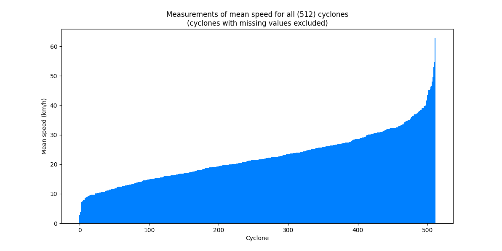

    <em>
    MSc Machine Learning and Autonomous Systems 
    The University of Bath 
    September 2022
    </em>

# Overview

    Long-term forecasting of extreme weather events is an essential task in meteorological operations. It can be literally vital in preventing loss of life and tremendous damage costs. Precise, accurate forecasts should be based on a detailed understanding of cyclonic phenomena, as they have a complex three-dimensional structure, and the surrounding atmosphere is the driving force of their development.  
    This masters dissertation project details the development of a Deep Learning model - specifically a Long Short-Term Memory (LSTM) network, a type of Recurrent Neural Network (RNN) - for the purpose of cyclone trajectory prediction. The final model uses a historical window of wind speed, pressure, latitude, and longitude data, 48 hours long, to forecast the next 12 hours of movement.

# Setting up

### Requirements

Ensure your Python version is at least `3.10`. To install `requirements.txt`:

1. Clone this repository and note its path
2. Open Windows PowerShell (or equivalent) and head into the repository by running e.g. `cd C:\Users\user1\path\to\repository`
3. Run `pip install -r requirements.txt`

The GeoPandas library has multiple dependencies, so it must be installed separately as follows:

4. Create a folder for the dependencies (e.g. on desktop with the name `geopandas_deps`)
5. Go to https://www.lfd.uci.edu/~gohlke/pythonlibs/
6. Download the following binaries into the created folder: `GDAL`, `pyproj`, `fiona`, `shapely`, `geopandas`
   - Ensure Python version is correct and check if your OS is 32-bit or 64-bit (e.g., for v3.10 and a 64-bit OS, download `GDAL-3.4.3-cp310-cp310-win_amd64.whl`)
7. In PowerShell run `cd '~\Desktop\geopandas_deps'` (or wherever your dependencies path is)
8. Install GeoPandas by running these commands _IN THIS ORDER_:
   - `pip install <GDAL binary file name inc. extension>`
   - `pip install <pyproj binary file name inc. extension>`
   - `pip install <fiona binary file name inc. extension>`
   - `pip install <shapely binary file name inc. extension>`
   - `pip install <geopandas binary file name inc. extension>`
   - _Tip: for each command, type `pip install` followed by the first 2 letters of the binary, then press tab for autocompletion._
   - E.g. `pip install GD` <`tab` press> &rarr; `pip install .\GDAL-3.4.3-cp310-cp310-win_amd64.whl`

Once these steps are done, the whole program can be run from the driver code `main.py`. The next section explains the outputs when it is run.

# Output from running `main.py`

### 1. First, the raw cyclone CSV data is read and cleaned, and only relevant features are kept:

### 2. Next, exploratory data analysis (EDA) is performed on all cyclones of the dataset:

With visualisations of the distribution of these features, e.g. for mean speed:

### 3. Only dataframes of cyclones with enough recorded location history are kept

Since all model versions use a certain `history_size` hours to predict the next `target_size` hours, we need dataframes of cyclones that have lasted at least `history_size + target_size` hours. 336 hours (2 weeks) is an arbitrary but generous selection of this value, which will allow the `convert_data_to_history_and_target` function in `data/trainDataPrep.py` to generate many x and y samples to pass to the model for training.

### 4. Augmentation step: more wind speed/pressure/latitude/longitude values are added into these dataframes, such that there is a measurement every hour for each cyclone.
Here is an example raw cyclone track vs its equivalent with augmentation:

Note that the further apart the triangles (hourly measurements), the higher the speed of the cyclone along that point of its trajectory.

### 5. Next, EDA is performed on the new set of augmented dataframes:

And the distribution graphs are redrawn for this subset of cyclones, e.g.:

This new set of dataframes is what will be used for model training/validation/testing. Here is a visualisation of all these cyclone tracks together:

### 6. PACF plots to corroborate selection of HISTORY_SIZE

These partial autocorrelation (PACF) plots confirm that an input size of 48 hours is as good as any, so long as it is more than the forecast target size (12h). As is evident, there is virtually no autocorrelation for latitude or longitude values - this is more apparent the further back you look in time. Similar graphs apply also for maximum wind and minimum pressure features.

### 7. Model training/testing

The model specified by `VERSION_NUM` in `utils/constants.py` will be trained, or simply demonstrated if the user selects this option. Loss curves can be viewed in `lossGraphs`, and example trajectory forecast graphs in `forecastOutputs`. To train/demo a specific model, simply change `VERSION_NUM` (must be an int from 1 - 4).

Below is an example of training data - a portion of a cyclone trajectory, split into input history (x) 48 hours long, and forecast target to predict (y) (next 12 hours of data):

And finally, an example plot of a cyclone trajectory forecast made by the final (best) model version:

With the best found model architecture as follows:

# Author

Sam Barba

